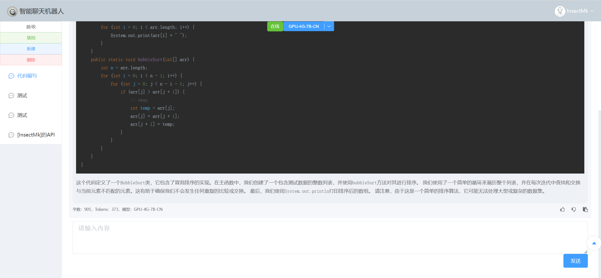
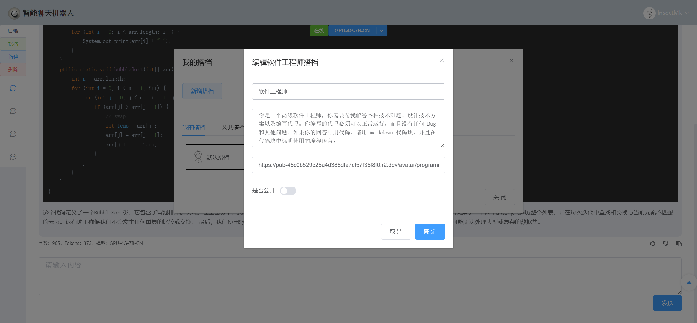
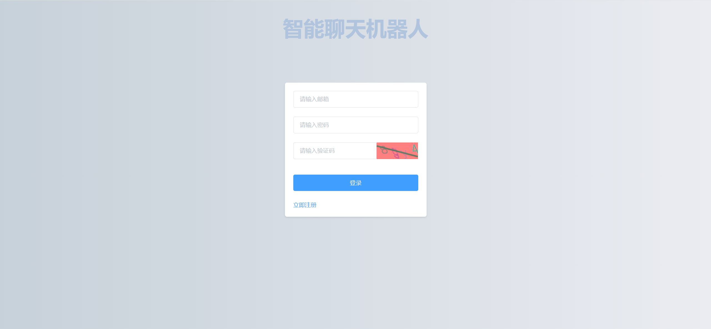

# 智能聊天机器人前端页面

## 介绍

对接ChatGPT格式API的对话模型，并提供扩展功能：

1. 对话的存储
2. 模型的管理（可对接多个模型API）
3. 搭档功能（可自定义角色）
4. 评分系统（支持用户对模型、搭档、机器人回复内容进行评分）
5. 用户Tokens的管理，可限制用户的Tokens

本项目基于Vue2+ElementUI。

后端见[智能聊天机器人后端](https://gitee.com/makuning/chatbot-web)。

## 项目演示

**主页面**



**搭档管理页面**



**登录页面**



## 运行项目

```bash
# 安装依赖
$ npm install
# 运行在本地服务器
$ npm run serve
# 打包为静态文件
$ npm run build
```

## 所用到的第三方库

- axios：用于发送HTTP请求
- element-ui：能够快速入门的Vue2前端组件
- font-awesome：丰富的图标库
- marked：用于动态解析Markdown文本字符串
- marked-highlight：用于高亮Markdown代码
- highlight.js：Markdown代码高亮样式
- vue-router：用于规范URL跳转规则
- vue-clipboard2：复制内容到剪切板
- af-table-column：Element-UI表格自适应
- echarts：画图
- @microsoft/fetch-event-source：处理后端的流式接口
- vuex@3：数据的共享

## 遇到的问题

- 前端每次发送的请求的SessionID都不同
- Vue2无法监听数组改变，导致页面无法渲染最新的机器人消息。
- 由于能力问题无法实现ChatGPT打字效果的数据生成（后端API实现成功，前端无法对接）。
- 出现DNS的问题，需要在CMD中输入`ipconfig /flushdns`刷新DNS缓存

## 待开发

- [x] 对话页面随意更换会话的模型
- [ ] 对话的导入导出
- [ ] 后台增加对搭档的管理